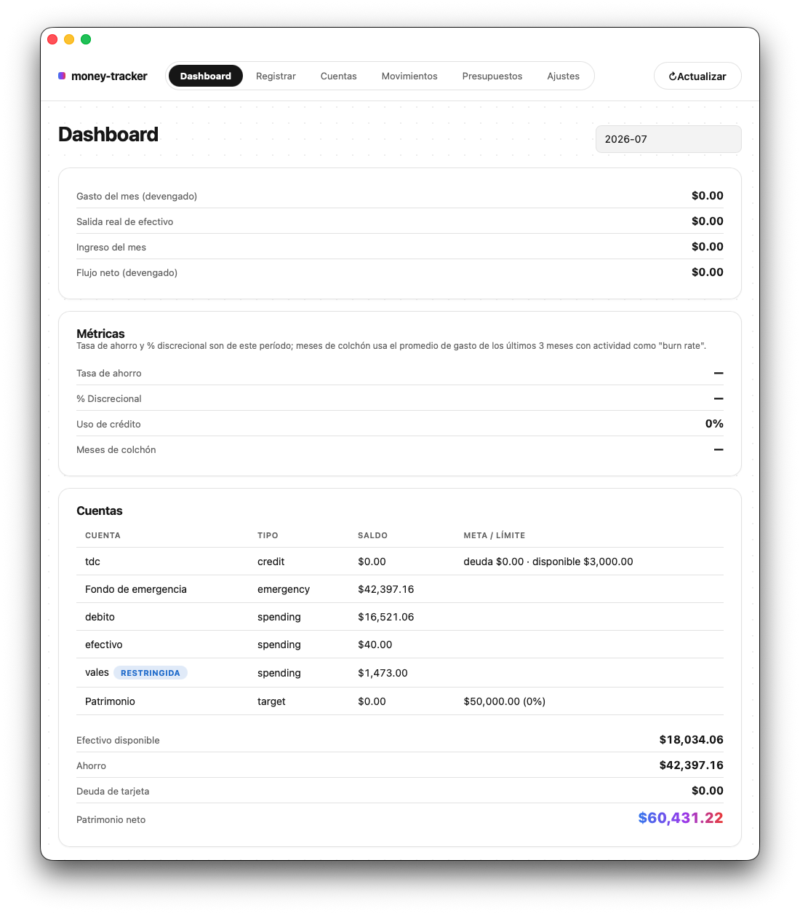

# money-tracker

Control de finanzas personales desde la terminal y/o una app de escritorio nativa. Cuentas (efectivo,
débito, vales, tarjeta de crédito), buckets de ahorro (fondo de emergencia + metas), presupuestos
informativos, y un reporte mensual que distingue "cuánto gasté" de "cuánto salió de mi bolsillo".

Reemplaza un dashboard de Excel que se había vuelto engorroso de mantener. El Excel
(`Dashboard_Financiero.xlsx`/`.ods`) queda como **referencia histórica de solo consulta** — ya no se
importa nada de él; una base de datos nueva arranca vacía y se carga con `setup`.

**Todo funciona 100% local por defecto.** No necesitas Supabase, ni internet, ni crear ninguna cuenta
para usar el CLI o la GUI — la app crea su propio archivo SQLite en la primera ejecución. Supabase es
un modo **opcional** para sincronizar entre varias máquinas (ver el [apéndice](#apéndice-modo-remoto-supabase-opcional)
al final); si nunca lo configuras, no afecta nada.

---

## Índice

1. [Instalación y ejecución](#1-instalación-y-ejecución)
2. [Core — cómo funciona](#2-core--cómo-funciona)
3. [CLI — set de instrucciones](#3-cli--set-de-instrucciones)
4. [GUI — vistas y funcionalidades](#4-gui--vistas-y-funcionalidades)
5. [Ejemplos](#5-ejemplos)
6. [Apéndice: modo remoto (Supabase, opcional)](#apéndice-modo-remoto-supabase-opcional)
7. [Apéndice: base de datos, backup y reset](#apéndice-base-de-datos-backup-y-reset)

---

## 1. Instalación y ejecución

### 1.1 Prerrequisitos

```sh
# Rust toolchain — obligatorio, es lo único que compila core/CLI/GUI-backend
curl --proto '=https' --tlsv1.2 -sSf https://sh.rustup.rs | sh
source ~/.cargo/env

# Node.js + pnpm — solo si vas a usar la GUI (no hace falta para el CLI)
# instala Node con nvm o desde nodejs.org, luego:
corepack enable   # o: npm i -g pnpm
```

No necesitas Supabase CLI, cuenta en Supabase, ni ninguna variable de entorno para lo que sigue.

### 1.2 Clonar y compilar

```sh
git clone <repo-url> money-tracker
cd money-tracker
cargo build --workspace   # compila money_core + cli + gui/src-tauri
```

Si esto compila sin errores, ya tienes todo lo necesario para correr el CLI. Verifica con:

```sh
cargo test --workspace   # deben pasar todos los tests
```

### 1.3 Core — archivos de configuración

`money_core` es una librería (no un binario), así que no la "ejecutas" directamente — el CLI y la GUI
la envuelven. Pero es donde vive toda la configuración, así que vale la pena entenderla antes de tocar
el CLI o la GUI:

| Qué | Dónde vive | Cómo se cambia |
|---|---|---|
| **Base de datos** | `~/.money-tracker/data.db` (SQLite) | Se crea sola. Otra ruta: `MONEY_TRACKER_DB` |
| **Conexión remota** (solo modo remoto) | `~/.money-tracker/config.toml` (`0600`) | `db remote login`, o env vars (ver abajo) |
| **Reglas del libro contable** | Tabla `config` dentro de la base | `config set` (CLI) o **Ajustes** (GUI) |

Detalle de cada uno:

- **Base de datos**: no hay que crearla, el primer comando la crea vacía.
- **Conexión remota**: el archivo tiene dos claves, `supabase_url` y `supabase_publishable_key`. Solo
  importa si usas el [modo remoto](#apéndice-modo-remoto-supabase-opcional). Overrides:
  - `MONEY_TRACKER_CONFIG=/ruta/config.toml` usa otro archivo.
  - `MONEY_TRACKER_SUPABASE_URL` y `MONEY_TRACKER_SUPABASE_KEY` ganan sobre lo que diga el archivo.
- **Reglas del libro contable**: `emergency_pct`, `default_account`, `income_account` y `cash_concept`.
  Viven dentro de la base, **no** en un archivo. Ver la [tabla de claves](#3-cli--set-de-instrucciones).

La distinción importante: el `config.toml` dice *dónde está* el libro contable (local vs. Supabase); la
tabla `config` de la base de datos son *reglas del libro contable en sí* (qué % va al fondo de
emergencia, etc.) — por eso esa segunda vive en la base de datos y se replica junto con tus cuentas y
movimientos.

`MONEY_TRACKER_DB` es la variable que más vas a usar en el día a día: apunta cualquier comando a un
archivo distinto (útil para probar algo sin tocar tu base real) sin cambiar nada más.

### 1.4 CLI

**Desde el proyecto (sin instalar nada)** — usa `cargo run`, recompila si hiciste cambios:

```sh
cargo run -p money-tracker -- report
cargo run -p money-tracker -- add 350 Alimentos
```

**Instalado en la máquina** — compila en modo release una vez y copia el binario a tu `PATH`:

```sh
cargo build --release -p money-tracker
sudo cp "$(git rev-parse --show-toplevel)/target/release/money-tracker" /usr/local/bin/
```

El binario siempre queda en `target/` de la **raíz** del repo, aunque compiles desde `gui/` u otra
subcarpeta (así funcionan los workspaces de Cargo). Por eso el `cp` usa `git rev-parse
--show-toplevel`: funciona desde cualquier carpeta del proyecto. Un `cp target/release/...` relativo
falla con `No such file or directory` si no estás en la raíz.

Después de esto, desde cualquier carpeta:

```sh
money-tracker report
money-tracker add 350 Alimentos
```

Ambas formas usan los mismos datos (el mismo `data.db`, o Supabase si está configurado). La
diferencia: `cargo run` siempre corre el código actual del repo, y el binario instalado es una
**copia congelada** del día en que lo copiaste. No se actualiza solo. Ver
[1.6](#16-actualizar-o-reinstalar-instalación-limpia).

No hace falta ningún paso previo de "setup" para empezar — el primer comando que corras crea la base
de datos vacía automáticamente. Para cargar saldos iniciales reales, ver [`setup`](#5-ejemplos).

### 1.5 GUI

**Desde el proyecto (modo desarrollo)**:

```sh
cd gui
pnpm install
pnpm tauri dev       # abre una ventana nativa, con los mismos datos que el CLI
```

**Instalado en la máquina** — genera un instalador nativo de la plataforma:

```sh
cd gui
pnpm install
pnpm tauri build
```

El instalador queda en `gui/src-tauri/target/release/bundle/<plataforma>/`:
- **macOS**: `.dmg` / `.app`
- **Windows**: `.msi` / `.exe` (NSIS)
- **Linux**: `.deb` / `.AppImage`

Instala ese paquete como cualquier app de escritorio (por ahora la app se llama `gui`, por el
`productName` de `gui/src-tauri/tauri.conf.json`). Usa los mismos datos y el mismo modo que el CLI.
**CLI y GUI pueden correr al mismo tiempo** (la conexión SQLite abre en modo WAL, así que no se
pisan).

**Nota solo para quien vaya a modificar el código de la GUI** (no aplica a uso normal): si cambias o
agregas un campo en un modelo de `money_core` consumido por el frontend, regenera los tipos TS:

```sh
cargo test -p money_core --features ts-rs   # reescribe gui/src/bindings/*.ts
```

### 1.6 Actualizar o reinstalar (instalación limpia)

`cargo build` solo actualiza `target/`. **Nunca toca** lo que ya copiaste a `/usr/local/bin` ni la
GUI que instalaste. Si haces `git pull`, cambias de rama, o vuelves al proyecto después de un tiempo,
lo instalado sigue siendo la versión vieja.

Síntoma típico: un comando que el README documenta "no existe":

```
$ money-tracker db remote status
error: unrecognized subcommand 'remote'
```

Eso no es un fallo de compilación. Es un binario instalado anterior a ese comando.

**Diagnóstico**: compara el binario instalado contra el código actual:

```sh
which money-tracker                     # ¿cuál estás corriendo? (normalmente /usr/local/bin/money-tracker)
ls -la "$(which money-tracker)"         # ¿de qué fecha es?
money-tracker db --help                 # lo que sabe el instalado
cargo run -p money-tracker -- db --help # lo que sabe el código actual
```

Si las dos ayudas no coinciden, reinstala.

**Instalación limpia, desde cero o para actualizar**:

```sh
cd ~/Projects/money-tracker
git status                              # confirma en qué rama estás: eso es lo que vas a instalar
git pull

# CLI
cargo build --release -p money-tracker
sudo cp "$(git rev-parse --show-toplevel)/target/release/money-tracker" /usr/local/bin/

# GUI (solo si la instalaste como app)
cd gui
pnpm install
pnpm tauri build                        # luego instala el paquete de src-tauri/target/release/bundle/
cd ..

# verificar
money-tracker db --help                 # debe listar todos los subcomandos del README
money-tracker db remote status          # confirma el modo con el que arrancas (local o remoto)
```

Reinstalar **no toca tus datos**: `~/.money-tracker/data.db`, `config.toml` y la sesión en el llavero
viven fuera del repo y del binario.

**Ojo con mezclar versiones**: un binario anterior a la rama de Supabase no conoce el modo remoto e
ignora `config.toml`. Siempre escribe directo en `~/.money-tracker/data.db`. Si tu configuración está
en modo remoto, ese archivo es solo el espejo de Supabase, así que lo que registres con el binario
viejo **no llega a Supabase** y la GUI no lo va a ver. Usa siempre la misma versión en CLI y GUI.

---

## 2. Core — cómo funciona

`money_core` es el modelo puro: SQLite embebido (rusqlite, sin dependencias externas), modelos y
servicios. No imprime nada, no pregunta nada, no parsea argumentos — el CLI y la GUI son dos
"manejadores" delgados sobre la misma librería (`cargo tree -p money_core` nunca debe mostrar
`clap`/`dialoguer`/`tabled`/`tauri`).

### El modelo de datos

Todo movimiento de dinero es una **entrada** (`entry`) entre **cuentas**, o a través del borde del
sistema. Dos tablas cargan con todo el modelo:

```
accounts(id, name UNIQUE, kind CHECK IN ('spending','emergency','target','credit'),
         target_amount, credit_limit, liquid, archived)

entries(id, date, kind CHECK IN ('income','expense','transfer','opening'),
        amount CHECK(amount > 0),           -- siempre positivo; kind da la dirección
        from_account_id, to_account_id,     -- exactamente una de estas dos formas:
        concept, subconcept, description)   --   income/opening: solo to · expense: solo from · transfer: ambos
```

**Tipos de entrada**:

| Tipo | Significado |
|---|---|
| `income` | Entra dinero al sistema (nómina, vales, etc.) |
| `expense` | Sale dinero del sistema (un gasto) |
| `transfer` | Se mueve entre dos cuentas — **no es gasto ni ingreso** |
| `opening` | Saldo inicial cargado con `setup` — no cuenta como ingreso |

**Tipos de cuenta** (`kind`):

- **`spending`** — efectivo, débito, vales. Puede marcarse `liquid=false` (`--restricted` en
  `account add`): el aporte automático al fondo de emergencia nunca se dispara sobre una cuenta no
  líquida (ej. vales de despensa, que no se pueden mover físicamente a ahorro).
- **`emergency`** — el fondo de emergencia. Solo puede haber **una** cuenta activa de este tipo (índice
  único parcial en el esquema). Recibe automáticamente un `emergency_pct`% (default 10%, configurable)
  de cada `income` que caiga en una cuenta líquida.
- **`target`** — un bucket de ahorro, con o sin meta (`target_amount` es opcional incluso en este tipo,
  para un bucket abierto tipo "Patrimonio" sin objetivo específico).
- **`credit`** — una tarjeta de crédito. Su saldo derivado va en negativo = deuda. Pagarla es una
  `transfer`, nunca un `expense` nuevo (evita contarlo dos veces).

**Los saldos se derivan, nunca se almacenan**: `account_balances` es una vista SQL que calcula
`SUM(to) - SUM(from)` por cuenta. No existe ningún `UPDATE ... current_balance` en el código — el
saldo no puede desincronizarse del historial, y por eso un saldo cargado con `setup` sigue ahí el mes
siguiente (no hay ningún concepto de "flujo mensual" almacenado, solo una consulta sin filtro de
fecha).

### Los dos números del reporte

Como un gasto se puede pagar desde una cuenta de gasto, una tarjeta de crédito, o directo de un bucket
de ahorro, "cuánto gasté este mes" tiene dos respuestas honestas y distintas — el `report` muestra
ambas:

- **Gasto del mes (devengado)** — todo lo que consumiste este mes, sin importar la fuente. Contra esto
  compara el presupuesto.
- **Salida real de efectivo** — lo que realmente salió de tus cuentas de gasto, incluyendo pagos de
  tarjeta hechos ese mes (que no financian nada nuevo, solo liquidan un cargo de un mes anterior).

`report --detail` desglosa el devengado en pagado-con-flujo / financiado-con-ahorro / a-crédito.

### Versionado de esquema

`open_db()` valida `PRAGMA user_version`. Una base creada por una versión anterior al rediseño actual
(detectada por la presencia de las tablas viejas `transactions`/`buckets`) se rechaza con un error
accionable — no hay migración automática desde ese esquema (`AppError::LegacySchema`). Ver
[`db status`](#apéndice-base-de-datos-backup-y-reset).

### Arquitectura interna (por si vas a tocar el código)

```
money_core/src/
  db.rs           # conexión, esquema, PRAGMA user_version
  period.rs       # Period ("YYYY-MM") — única fuente de verdad para fechas
  storage/        # trait LedgerBackend + SqliteBackend (local) + SupabaseBackend (remoto)
  sync/           # MirroringBackend, para cuando el modo remoto está activo
  models/         # AccountKind, NewAccount, AccountBalance, EntryKind, NewEntry, Entry, Budget, Concept, Config
  services/       # account_service, entry_service (único escritor de `entries`), report_service, setup_service
tests/scenarios.rs  # tests de integración vía la API pública, sin tocar SQL directo
```

`cli/` (binario clap + dialoguer) y `gui/src-tauri/` (comandos Tauri) son ambos manejadores delgados
sobre estos mismos `services/`. Ninguno de los dos duplica lógica de negocio.

---

## 3. CLI — set de instrucciones

Todos los comandos que registran dinero resuelven uno de tres modos según qué banderas pases
(`cli/src/commands/helpers.rs::PromptMode`):

- **`Wizard`** — sin argumentos, o con `-i`/`--interactive`: pregunta todo, incluyendo opcionales.
- **`Fill`** — algunos argumentos: solo pregunta por los campos requeridos que falten.
- **`Strict`** — con `--yes`: nunca pregunta, falla si falta algo requerido. Es el modo para scripts.

### Referencia de comandos

| Comando | Subcomando | Qué hace |
|---|---|---|
| `add` | — | Registrar un gasto |
| `income` | — | Registrar un ingreso (aparta `emergency_pct`% al fondo de emergencia) |
| `transfer` | — | Mover dinero entre dos cuentas (pago de tarjeta, retiro de cajero…) |
| `bucket` | `deposit` | Depositar a un bucket de ahorro |
| | `withdraw` | Retirar de un bucket (**no es un gasto**) |
| `account` | `add` | Crear una cuenta |
| | `list` | Listar cuentas con su saldo (`--all` incluye archivadas) |
| | `archive` | Archivar (rechaza si el saldo no es cero, salvo `--force`) |
| | `reconcile` | Cuadrar el sobre de efectivo contra lo que contaste |
| `entry` | `list` | Listar movimientos, con filtros |
| | `edit` | Corregir un movimiento (monto, concepto, cuenta, fecha…) |
| | `rm` | Borrar un movimiento por id |
| `concept` | `list` / `add` | Gestionar conceptos |
| `budget` | `set` / `show` / `rm` | Presupuesto mensual (informativo, nunca bloquea) |
| `report` | — | Reporte del mes, ver [los dos números](#los-dos-números-del-reporte) |
| `config` | `list` / `get` / `set` | Reglas del libro contable (claves abajo) |
| `setup` | — | Cargar saldos iniciales en una base nueva |
| `db` | `status` / `reset` | Inspeccionar o reiniciar la base ([apéndice](#apéndice-base-de-datos-backup-y-reset)) |
| | `remote …` | Modo Supabase ([apéndice](#apéndice-modo-remoto-supabase-opcional)) |

Sintaxis (`[...]` es opcional; cualquier comando acepta `--help`):

```
add <MONTO> <CONCEPTO> [--from CUENTA] [-s SUBCONCEPTO] [-d DESCRIPCION] [-D FECHA] [--new-concept]
income <MONTO> <CONCEPTO> [--to CUENTA] [-d DESCRIPCION] [-D FECHA] [--no-emergency] [--new-concept]
transfer -a MONTO --from CUENTA --to CUENTA [-d DESCRIPCION] [-D FECHA]
bucket deposit  -b BUCKET -a MONTO [--from CUENTA] [-D FECHA]
bucket withdraw -b BUCKET -a MONTO [--to CUENTA] [-D FECHA]
account add <NOMBRE> --kind <spending|emergency|target|credit> [--target N] [--limit N] [--restricted]
account list [--all]
account archive <NOMBRE> [--force]
account reconcile <NOMBRE> --actual N [-c CONCEPTO] [-D FECHA]
entry list [-p PERIODO] [-c CONCEPTO] [--account NOMBRE] [--kind K] [-n LIMITE]
entry edit <ID> [-a MONTO] [-c CONCEPTO] [-s SUBCONCEPTO] [-d DESCRIPCION] [-D FECHA] [--from CUENTA] [--to CUENTA]
entry rm <ID>
concept list
concept add <NOMBRE> [-t TIPO]
budget set -c CONCEPTO -l LIMITE [-p PERIODO]
budget show [-p PERIODO]
budget rm -c CONCEPTO [-p PERIODO]
report [-p PERIODO] [--detail]
config list
config get <CLAVE>
config set <CLAVE> <VALOR>
setup [--account NOMBRE=MONTO ...] [-D FECHA] [--force]
db status
db reset [--backup=false] [--yes]
```

`-D FECHA` es `YYYY-MM-DD` y `-p PERIODO` es `YYYY-MM`. Sin `-p`, `report` usa el mes actual y
`entry list` muestra todos los movimientos.
`add`, `income` y `transfer` también aceptan `-i` (wizard completo) y `--yes` (nunca pregunta); ver los
modos arriba.

Config keys (`config set <clave> <valor>`):

| Clave | Uso | Default |
|---|---|---|
| `emergency_pct` | % de cada `income` líquido que se aparta al fondo de emergencia | `10` |
| `default_account` | Cuenta usada por `add --from` si se omite | — |
| `income_account` | Cuenta usada por `income --to` si se omite | — |
| `cash_concept` | Concepto usado por `account reconcile` para el sobrante/faltante | — |

---

## 4. GUI — vistas y funcionalidades

La GUI (Tauri v2 + React) es un **segundo manejador** sobre el mismo `money_core` — misma base de
datos, misma lógica de negocio, paridad completa de operaciones con el CLI. No hay ninguna acción que
solo exista en uno de los dos, salvo detalles de presentación (donuts de presupuesto, wizard visual).



Cada pestaña de la barra superior es una vista (`gui/src/routes/`):

| Vista | Qué muestra / permite | Equivalente en CLI |
|---|---|---|
| **Dashboard** | Reporte del mes, gastos por concepto, saldos, patrimonio neto | `report` |
| **Registrar** | Formularios de gasto, ingreso y transferencia | `add`, `income`, `transfer` |
| **Cuentas** | Crear y listar cuentas, depositar/retirar de buckets, cuadrar efectivo | `account *`, `bucket *` |
| **Movimientos** | Listar con filtros, editar o borrar un movimiento | `entry list/edit/rm` |
| **Presupuestos** | Crear/ver presupuestos, con donut de % consumido | `budget *` |
| **Ajustes** | Reglas del libro contable, conceptos, panel de sincronización remota | `config *`, `concept *`, `db remote *` |
| **SetupWizard** | Solo con la base vacía: crear cuentas y cargar saldos iniciales | `account add` + `setup` |

El Dashboard tiene selector de período y muestra los mismos [dos números](#los-dos-números-del-reporte) que
`report`. El SetupWizard reemplaza toda la app mientras no haya ninguna cuenta.

**Cómo se mantiene sincronizada la UI consigo misma**: no hay router ni librería de queries — como el
IPC de Tauri es local (no hay latencia de red que optimizar), `hooks/useApi.ts` mantiene un contador de
"revisión" global que se incrementa después de cada mutación, y todo componente que lee datos vuelve a
pedirlos cuando ese contador cambia. `hooks/useSync.ts` hace lo mismo automáticamente cada ~30 s
*solo* cuando el modo remoto está activo y el watermark del espejo avanzó.

El backend Tauri (`gui/src-tauri/src/commands/`) es un archivo por grupo de comandos —
`accounts.rs`, `buckets.rs`, `budgets.rs`, `concepts.rs`, `config.rs`, `entries.rs`, `report.rs`,
`setup.rs`, `sync.rs` — cada uno con un `#[tauri::command]` por llamada a un servicio de `money_core`,
más `AppState` (la conexión SQLite compartida) y `ApiError` (porque `AppError` no es `Serialize`).

---

## 5. Ejemplos

```sh
# Crear las cuentas (una sola vez)
money-tracker account add efectivo --kind spending
money-tracker account add debito --kind spending
money-tracker account add vales --kind spending --restricted
money-tracker account add "Fondo de emergencia" --kind emergency
money-tracker account add Vacaciones --kind target --target 50000
money-tracker account add tdc --kind credit --limit 30000
money-tracker config set default_account debito

# Cargar saldos iniciales
money-tracker setup --account "Fondo de emergencia"=35000 --account debito=18000 -D 2026-08-01

# Registrar un gasto (usa default_account si se omite --from)
money-tracker add 350 Alimentos

# Gasto pagado con tarjeta
money-tracker add 1800 Discrecional --from tdc

# Pagar la tarjeta el mes siguiente
money-tracker transfer -a 1800 --from debito --to tdc

# Registrar un ingreso (aporta automáticamente al fondo de emergencia)
money-tracker income 24000 Nomina

# Vales de despensa: no dispara aporte a emergencia (cuenta restringida)
money-tracker income 2400 "Vales de Despensa" --to vales

# El sobre de efectivo: retirar y, a fin de mes, cuadrar lo que quedó
money-tracker transfer -a 1000 --from debito --to efectivo
money-tracker account reconcile efectivo --actual 150

# Depositar / retirar de un bucket de ahorro
money-tracker bucket deposit -b Vacaciones -a 2000 --from debito
money-tracker bucket withdraw -b "Fondo de emergencia" -a 4200 --to debito

# Gastar directo de un bucket, sin retirar primero
money-tracker add 4200 Servicios --from "Fondo de emergencia"

# Presupuesto (informativo)
money-tracker budget set -c Alimentos -l 2500 -p 2026-08
money-tracker budget show -p 2026-08

# Ver el reporte del mes
money-tracker report -p 2026-08 --detail

# Ver todas las cuentas
money-tracker account list
```

### Escenario completo de un mes

Flujo típico, en las propias palabras con las que se pensó el diseño:

> 1. yo recibo mi ingreso, se separa su porcentaje al fondo de emergencia
> 2. si tengo algún bucket, le destino parte de mi ingreso a discreción
> 3. voy a ir al cajero a hacer un retiro de efectivo para mi sobre
> 4. uso la tarjeta de débito y/o la de vales para los gastos
> 5. por lo general, los gastos en efectivo serán discrecionales, pero puede que no siempre — quizá en
>    la gasolinera no acepten tarjeta, o salió alguna reparación imprevista (ej. se ponchó una llanta)
> 6. si la junté lana para lo que tenía destinado cierto bucket, hago un retiro del bucket y lo gasto
>    (juntaba para unos tenis y voy y los compro; juntaba para la reparación del carro y retiro en
>    efectivo para pagar)
> 7. si surge una emergencia aplico el punto anterior pero para el fondo de emergencia
> 8. de mi remanente hago una "aportación voluntaria" a mi fondo de emergencia para "reponerlo"

Comando por comando:

**1. Ingreso con reparto automático al fondo de emergencia**

```sh
money-tracker income 20000 Nomina
```

Si `income_account` (default `debito`) es líquida y existe un `Fondo de emergencia`, la app aparta
sola el `emergency_pct`% — no hay paso manual.

**2. Destinar parte del ingreso a un bucket**

```sh
money-tracker account add Tenis --kind target --target 2000   # una sola vez
money-tracker bucket deposit -b Tenis -a 500 --from debito
```

Es una transferencia: no mueve "Gasto del mes".

**3. Retiro de cajero para el sobre de efectivo**

```sh
money-tracker transfer -a 1000 --from debito --to efectivo
```

**4. Gastos con débito/vales — se registran al momento**

```sh
money-tracker add 350 Alimentos --from debito
money-tracker add 250 Alimentos --from vales
```

**5. Gasto en efectivo que sí puedes identificar (no siempre es discrecional)**

Si sabes en el momento que fue gasolina o una reparación, regístralo con su concepto real — no esperes
al cuadre de fin de mes:

```sh
money-tracker add 450 Extraordinario --from efectivo -d "llanta ponchada"
```

Solo lo que de verdad no puedas rastrear cae en `account reconcile efectivo --actual N` al cierre del
mes, y ese sobrante cae por default en `Discrecional` (tu `cash_concept`).

**6. Bucket completo → retiro y gasto**

Compra directa (tenis), sin pasar por efectivo:

```sh
money-tracker add 2000 Discrecional --from Tenis -d "tenis nuevos"
```

Reparación que necesitas pagar en efectivo — retiro y gasto son dos hechos distintos:

```sh
money-tracker bucket withdraw -b "Fondo Auto" -a 2500 --to efectivo
money-tracker add 2500 Extraordinario --from efectivo -d "pago reparación del carro"
```

**7. Emergencia real — mismo patrón que el 6, con el fondo de emergencia**

```sh
money-tracker bucket withdraw -b "Fondo de emergencia" -a 3000 --to debito
money-tracker add 3000 Extraordinario --from debito -d "gasto médico imprevisto"
```

**8. Aportación voluntaria para reponer el fondo**

```sh
money-tracker bucket deposit -b "Fondo de emergencia" -a 1500 --from debito
```

Es un depósito manual, no pasa por `income` — no vuelve a dispararse ningún % automático sobre dinero
que ya era tuyo.

### Salida del reporte

```
╔══════════════════════════════════════╗
║     REPORTE MENSUAL   2026-08        ║
╚══════════════════════════════════════╝

   Gasto del mes (devengado): $6650.00
    pagado con flujo del mes  4850.00
       financiado con ahorro  0.00
                   a crédito  1800.00
     Salida real de efectivo: $4850.00

             Ingreso del mes: $24000.00
      Flujo neto (devengado): $17350.00
            Aportes a ahorro: $2400.00

Gastos por concepto:
+--------------+----------+---------+------+----+
| Concepto     | Gastado  | Presup. | %    | #  |
+--------------+----------+---------+------+----+
| Discrecional | $1800.00 | —       | —    | 1  |
+--------------+----------+---------+------+----+
| Alimentos    | $350.00  | $2500   | 14%  | 1  |
+--------------+----------+---------+------+----+

Cuentas:
  Fondo de emergencia       $37400.00
  Vacaciones                $2000.00 / $50000.00 (4%)
  tdc                       $0.00 (deuda $1800.00 · disponible $28200.00)
  debito                    $15250.00
  efectivo                  $150.00

 Efectivo disponible: $15400.00
              Ahorro: $39400.00
    Deuda de tarjeta: $1800.00
     Patrimonio neto: $53000.00
```

---

## Apéndice: modo remoto (Supabase, opcional)

Todo lo anterior funciona sin esto. Esta sección es solo para quien quiera sincronizar el mismo libro
contable entre varias máquinas usando Supabase como ledger alojado, con un espejo local en SQLite.
Sin configurar nada de esto, la app se comporta exactamente como en las secciones 1–5 (base local).

### Setup desde cero

#### 1. Supabase CLI (solo para aplicar las migraciones)

```sh
brew install supabase/tap/supabase   # macOS
# o: npm i -g supabase
```

#### 2. Crear el proyecto en Supabase

1. Entra a [supabase.com](https://supabase.com) → New Project.
2. Anota dos valores:
   - **Project URL**: `https://<ref>.supabase.co`
   - **Publishable key** (Project Settings → API → key `sb_publishable_*`)

#### 3. Aplicar las migraciones a Supabase

```sh
cd money-tracker
supabase login
supabase link --project-ref <tu-project-ref>
supabase db push
```

Esto crea en el remoto: tablas, RLS, triggers, índices, la vista `account_balances` y los RPCs
`apply_entries` / `pull_changes`.

#### 4. Configurar las credenciales (3 opciones, en orden de prioridad)

**Opción A — Variables de entorno** (recomendada para scripts/CI):

```sh
export MONEY_TRACKER_SUPABASE_URL="https://<ref>.supabase.co"
export MONEY_TRACKER_SUPABASE_KEY="sb_publishable_..."
```

**Opción B — Archivo de configuración** (persistente, `0600`):

```sh
mkdir -p ~/.money-tracker
cat > ~/.money-tracker/config.toml <<EOF
supabase_url = "https://<ref>.supabase.co"
supabase_publishable_key = "sb_publishable_..."
EOF
chmod 600 ~/.money-tracker/config.toml
```

**Opción C — Flags en `db remote login`** (solo para esa invocación):

```sh
money-tracker db remote login --url "https://<ref>.supabase.co" --key "sb_publishable_..."
```

#### 5. Iniciar sesión

```sh
money-tracker db remote login
```

Te pedirá email + password de tu usuario de Supabase Auth. El **refresh token** se guarda en el
llavero del SO (macOS Keychain / Windows Credential Manager / Linux Secret Service), con fallback a un
archivo `0600` en sesiones headless. El **password nunca se persiste**.

#### 6. Verificar la conexión

```sh
money-tracker db remote status
```

Debe mostrar: `Modo: remoto (Supabase)`, `Sesión: activa`, `Revisión remota: 0`, `Espejo local: en
revisión 0`.

#### 7. (Opcional) Migrar una base local existente

Si ya traías datos en `~/.money-tracker/data.db`:

```sh
money-tracker db remote migrate          # si el remoto está vacío
money-tracker db remote migrate --force  # si el remoto ya tiene datos
```

**Notas clave**

- **Nunca** uses la `service_role` key en la app — solo la `sb_publishable_*` (publishable/anon).
- El refresh token no se comparte entre máquinas: en una máquina nueva copia `config.toml` y vuelve a
  hacer `db remote login`.

### Comandos

```sh
# Ver el estado: modo (local/remoto), sesión, revisión remota y watermark del espejo
money-tracker db remote status

# Iniciar sesión (guarda url/key si los pasas; usa los ya configurados si no)
money-tracker db remote login [--url https://xxx.supabase.co --key <anon>]

# Traer cambios remotos al espejo de una vez (lo que la GUI hace cada 30 s)
money-tracker db remote sync

# Subir una base local existente a Supabase (remapea ids, comprueba el remoto vacío salvo --force)
money-tracker db remote migrate [--force] [--yes]

# Olvidar la sesión guardada
money-tracker db remote logout
```

Manual más profundo: [specs/001-supabase-backend/quickstart.md](specs/001-supabase-backend/quickstart.md).

### Si no quieres el prompt del keyring en cada reinicio (macOS / Linux)

La primera vez que la app accede al llavero del sistema, macOS (Keychain Access) o Linux
(gnome-keyring/kwallet) te piden el password de tu usuario para autorizar el acceso. Es el **SO quien
muestra el diálogo**, no la app — tu password nunca sale de ahí.

**macOS** — permitir acceso permanente a tu binario:

1. Abre **Keychain Access** (`Cmd+Space` → "Keychain Access")
2. Busca `money-tracker` (filtro: "money-tracker" / cuenta "supabase_refresh_token")
3. Doble clic → pestaña **Access Control**
4. Marca **"Allow all applications to access this item"**
   - O usa "Confirm before allowing access" y añade tu binario (`/ruta/a/money-tracker` o el de
     `target/release/money-tracker` si lo instalaste en `/usr/local/bin`)

**Linux (GNOME / gnome-keyring)** — desbloqueo automático al login:

- Si usas **auto-login**: el keyring se queda bloqueado y pide password la primera vez. Solución:
  establece un password en el keyring (Seahorse → "Passwords" → "Login" → Change Password) y asegúrate
  de que tu gestor de sesión lo desbloquee al iniciar sesión (la mayoría lo hace si el password del
  keyring = password de usuario).
- En **KDE / kwallet**: KWalletManager → cartera "kdewallet" → "Change Password" → usa el mismo
  password de usuario.

**Windows** — Credential Manager no suele pedir confirmación recurrente; la entrada queda guardada bajo
tu usuario.

### Reiniciar / volver a migrar el remoto

`db remote migrate --force` es **idempotente**: busca cuentas/concepts por nombre en el remoto, reusa
IDs si ya existen, y solo inserta lo que falte. Puedes ejecutarlo tantas veces como quieras contra el
mismo proyecto Supabase — añade/actualiza, no duplica.

Si quieres **limpiar todo el remoto y empezar de cero** con una base SQLite más actualizada:

**Opción A — Solo borrar datos (mantiene esquema y proyecto):**
```sh
# 1. Logout (opcional, limpia tu keyring local)
money-tracker db remote logout

# 2. En Supabase → SQL Editor, ejecuta:
TRUNCATE entries, budgets, config, accounts, concepts, sync_state, tombstones RESTART IDENTITY CASCADE;
INSERT INTO sync_state (id, revision) VALUES (1, 0) ON CONFLICT DO NOTHING;

# 3. Login de nuevo + migración fresca
money-tracker db remote login
money-tracker db remote migrate --force --yes
```

**Opción B — Proyecto Supabase nuevo (reset total, esquema limpio):**
```sh
# 1. Supabase Dashboard → Settings → General → Delete project (o crea uno nuevo)
# 2. Crea proyecto nuevo → anota URL + publishable key
# 3. Actualiza ~/.money-tracker/config.toml con la nueva URL/key
# 4. Aplica migraciones al proyecto nuevo:
supabase link --project-ref <nuevo-ref>
supabase db push

# 5. Login + migración desde tu base local (o otra vía MONEY_TRACKER_DB)
money-tracker db remote login
money-tracker db remote migrate --force --yes
```

**Opción C — Migrar desde una base SQLite distinta:**
```sh
# Usa tu base más actualizada como fuente
MONEY_TRACKER_DB=/ruta/a/otra.db cargo run -p money-tracker -- db remote migrate --force --yes
```

---

## Apéndice: base de datos, backup y reset

- **Ubicación**: `~/.money-tracker/data.db` (o `MONEY_TRACKER_DB` para apuntar a otra ruta, útil para
  pruebas). Se crea automáticamente al ejecutar cualquier comando.
- Una base de datos con el esquema anterior (`transactions`/`buckets`) se rechaza con un mensaje
  accionable — no hay migración automática.

```sh
# Ver ruta, versión de esquema, cuentas y movimientos
money-tracker db status

# Mover la base actual a un lado (data.db.backup-YYYYMMDDHHMMSS) y empezar limpio
# pide confirmación salvo que pases --yes
money-tracker db reset

# Lo mismo, sin preguntar
money-tracker db reset --yes

# Borrar la base actual sin dejar respaldo (irreversible)
money-tracker db reset --backup=false --yes
```

`db reset` no hace un backup "en paralelo" — mueve el archivo actual a un lado y el próximo comando
crea uno nuevo vacío. Para respaldar sin perder la base activa, copia el archivo mientras no haya un
comando escribiendo en él:

```sh
cp ~/.money-tracker/data.db ~/.money-tracker/data.db.bak-$(date +%Y%m%d)
```
